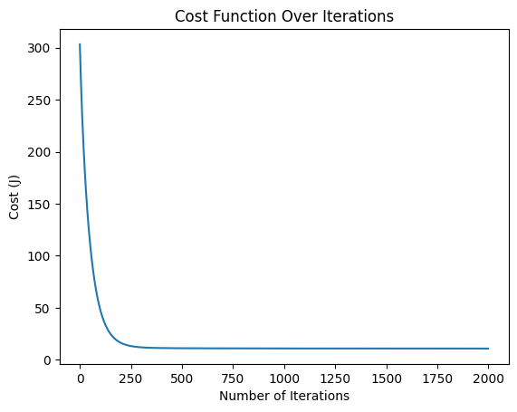

### Project: Building Linear Regression from Scratch in Python

### Overview
This project involves building, training, and validating a linear regression model from scratch using only Python and NumPy. The goal is to predict house prices from the Boston Housing dataset, demonstrating a fundamental understanding of the core mechanics of machine learning algorithms.

### Key Concepts & Skills Demonstrated
- **Linear Regression:** Implemented the complete algorithm from scratch in an object-oriented `LinearRegression` class.
- **Gradient Descent:** Used vectorised gradient descent to optimise the model's parameters by minimising the cost function.
- **Cost Function:** Implemented the Mean Squared Error (MSE) cost function, $J(\theta)$, to measure model performance.
- **Feature Scaling:** Applied Standardisation to preprocess the data, ensuring efficient model convergence.
- **Model Validation:** Verified the from-scratch implementation by comparing its performance against the industry-standard Scikit-learn library.
- **NumPy:** Utilised NumPy for all vectorised mathematical computations.

## Technologies Used
- Python
- NumPy
- Pandas
- Matplotlib
- Scikit-learn
- Jupyter Notebook

### Results

### Cost Function Convergence
The model was trained for 2000 iterations. The plot below shows the cost decreasing with each iteration, confirming that the gradient descent algorithm successfully converged to a minimum.



### Model Validation
The from-scratch model's performance was validated against Scikit-learn's `LinearRegression` model. The final Mean Squared Error on the unseen test set was nearly identical, proving the correctness of the implementation.

| Model                  | Final MSE on Test Set |
| ---------------------- | --------------------- |
| My From-Scratch Model  | **24.69**             |
| Scikit-learn's Model   | **24.29**             |

### How to Run
1. Clone the repository:
   ```bash
   git clone [https://github.com/matthewmich1/ML_from_scratch.git](https://github.com/matthewmich1/ML_from_scratch.git)
   ```
2. Navigate to the project directory:
   ```bash
   cd ML_from_scratch
   ```
3. Open and run the Jupyter Notebook:
   ```bash
   jupyter notebook "regression_from_scratch.ipynb"
   ```